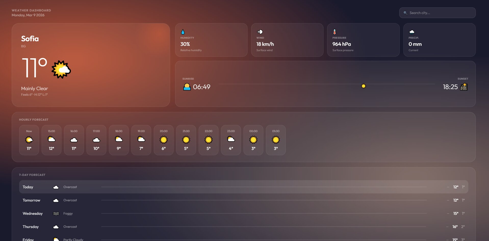
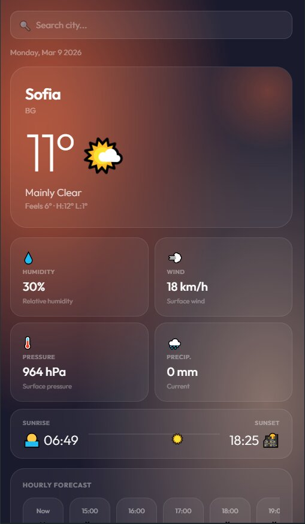
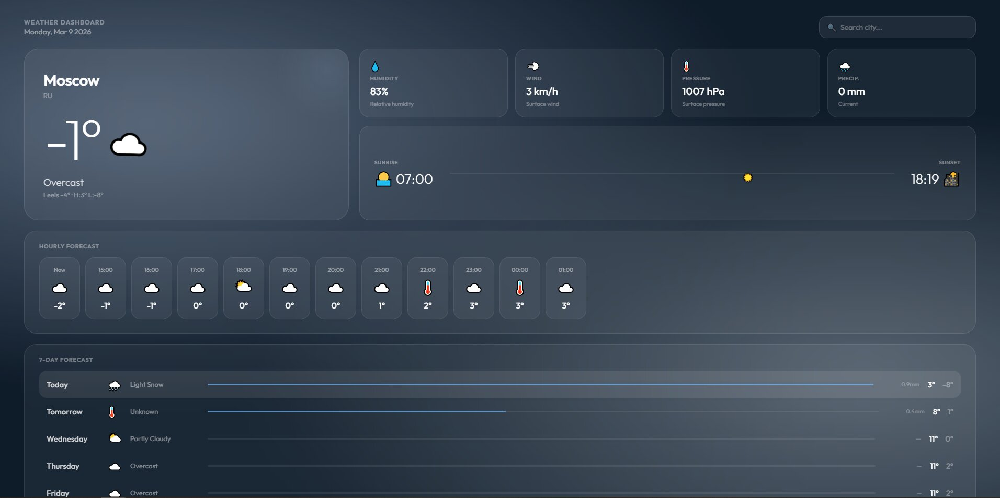
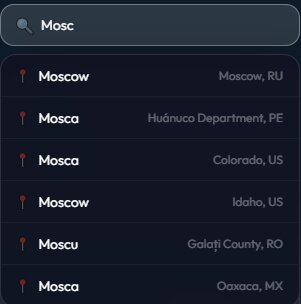

# 🌤️ Weather Dashboard

A responsive weather dashboard built with **React** and the free **Open-Meteo API**. Features real-time weather data, a 7-day forecast, hourly breakdown, and smooth animations — fully responsive across desktop and mobile.

---

## 📸 Screenshots

### Desktop View


### Mobile View


### Different Cities — Dynamic Theming


### City Search with Autocomplete


---

## ✨ Features

- 🔍 **City search** with live autocomplete suggestions
- 🌡️ **Current conditions** — temperature, feels-like, humidity, wind, pressure, precipitation
- 🕐 **Hourly forecast** — scrollable 12-hour strip
- 📅 **7-day forecast** — with rain bars and min/max temps
- 🌅 **Sunrise & sunset** tracker with live sun position indicator
- 🎨 **Dynamic theming** — background gradient changes based on weather conditions
- 📱 **Fully responsive** — optimised for both desktop and mobile
- ✨ **Animations** — staggered fade-ins, animated temperature counter, pulsing weather icon, shimmer loading skeletons

---

## 🛠️ Tech Stack

| Technology | Purpose |
|---|---|
| React 18 | UI framework |
| Vite | Build tool |
| Open-Meteo API | Free weather data (no API key needed) |
| Open-Meteo Geocoding API | City search & coordinates |
| CSS-in-JS (inline styles) | Styling & animations |

---

## 🚀 Getting Started

### Prerequisites
- Node.js 18+
- npm

### Installation

```bash
# Clone the repo
git clone https://github.com/TodorLambrev19/Weather-app.git

# Navigate into the project
cd Weather-app

# Install dependencies
npm install

# Start the dev server
npm run dev
```

Then open [http://localhost:5173](http://localhost:5173) in your browser.

### Build for Production

```bash
npm run build
```

---

## 📁 Project Structure

```
src/
├── api/
│   └── weather.js          # Open-Meteo API calls
├── assets/                 # Static assets
├── components/
│   ├── SearchBar.jsx        # City search with autocomplete
│   └── WeatherCard.jsx      # Main weather display card
├── contexts/
│   └── WeatherContext.jsx   # Global city/coords state
├── utils/
├── App.jsx                  # Root component & layout
└── main.jsx                 # Entry point
```

---

## 🌐 Live Demo

> 🔗 [View Live on Vercel](#) ← *(add your Vercel link here)*

---

## 📡 API Reference

This project uses the free [Open-Meteo API](https://open-meteo.com/) — no API key required.

- **Weather data:** `api.open-meteo.com/v1/forecast`
- **Geocoding:** `geocoding-api.open-meteo.com/v1/search`

---

## 👤 Author

**Todor Lambrev**
- GitHub: [@TodorLambrev19](https://github.com/TodorLambrev19)

---

## 📄 License

This project is open source and available under the [MIT License](LICENSE).